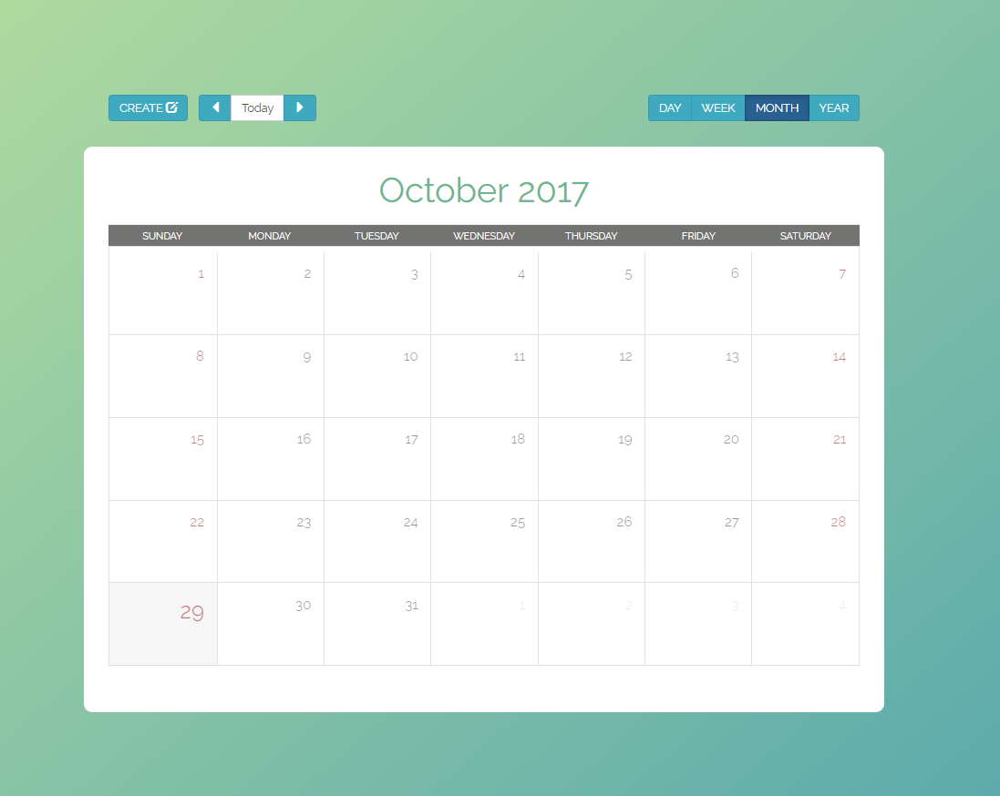
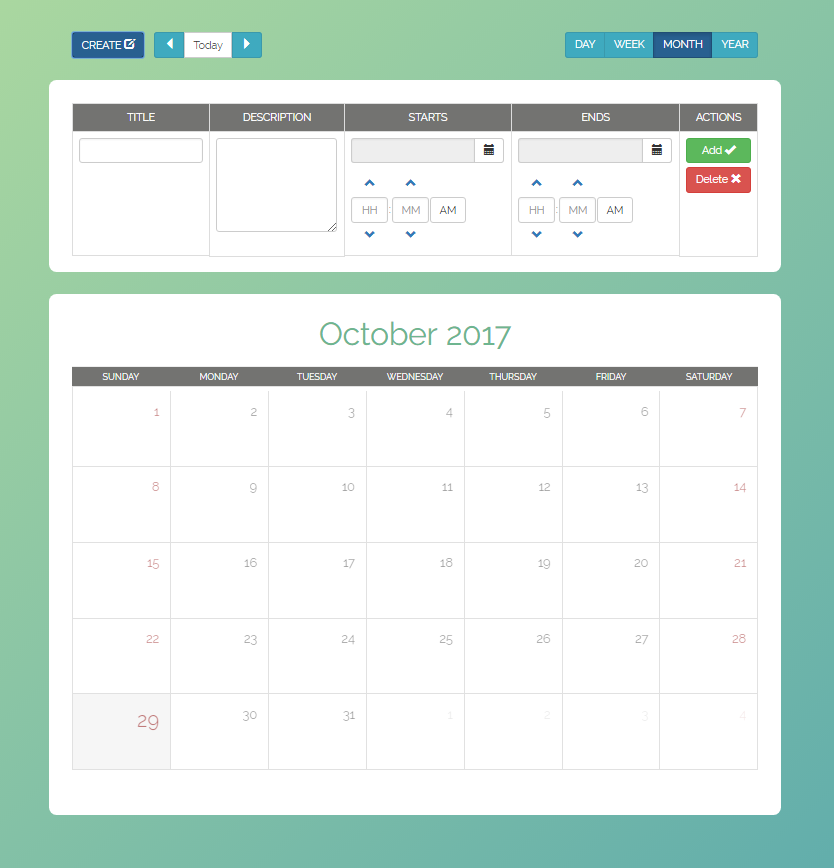
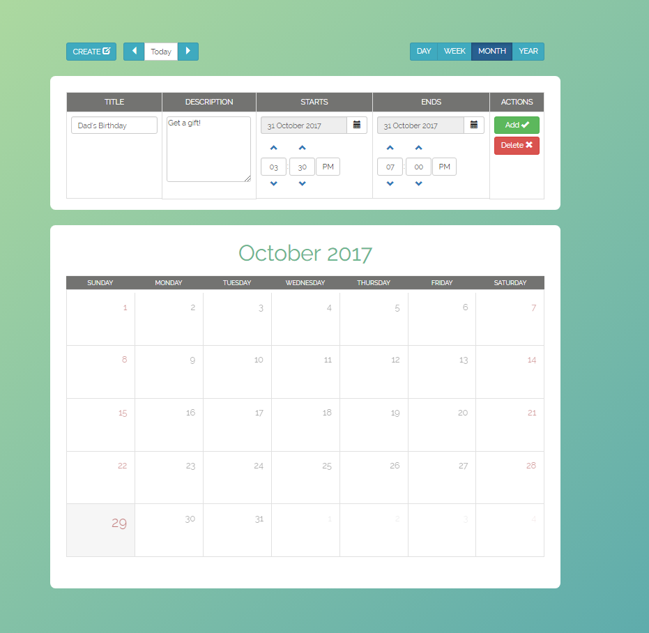
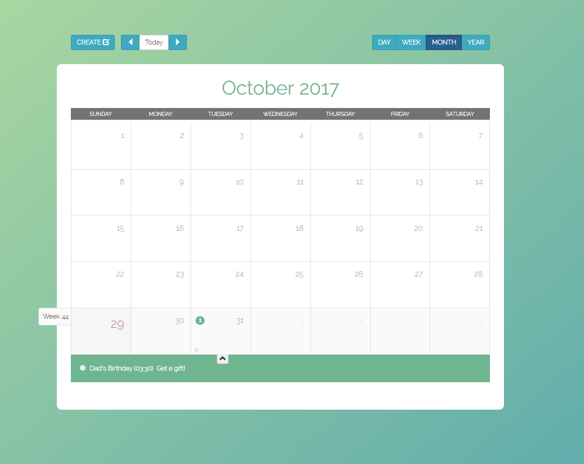

# Calendar Web App
This calendar web app is a basic cross-platform desktop app that shows you what you can do using <a href="https://mattlewis92.github.io/angular-bootstrap-calendar/#!?example=kitchen-sink">Angular Bootstrap Calendar</a>.

## Table of contents

- [Demo](#demo)
- [Screenshots](#screenshots)
- [About](#about)
- [Installation](#installation)

## Demo
👉 Watch it <a href="https://calendar-web-app.herokuapp.com/" target="_blank">here</a>.
<br>

## Screenshots:

  #### On Load
  
  
  #### Create an Event
  
  
  #### Add Event
  
  
  #### View Event
  


## About

Documentation for the original Angular Bootstrap Calendar can be found <a href="https://github.com/mattlewis92/angular-bootstrap-calendar/blob/master/README.md#documentation">here</a>.
<br>

## Installation

### For Developers
Clone the source locally:

```sh
$ git clone https://github.com/jsorkin24/calendar-web-app.git
```

Use your package manager to install `npm`.

Install project dependencies:

```sh
$ npm install
```
Start the app:
```sh
$ mongod
```

```sh
$ nodemon
```

### Build App
```sh
$ gulp
```

### Built with
- [Angular Bootstrap Calendar](https://github.com/mattlewis92/angular-bootstrap-calendar/blob/master/README.md#documentation)

